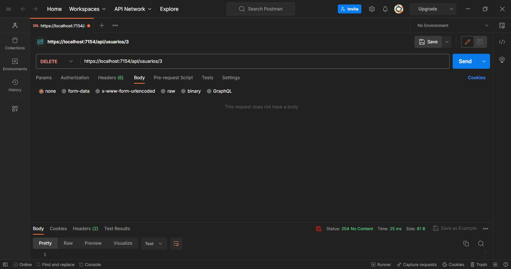

# Desenvolvimento de APIs

<p>Curso Programador Back-end | Entrega da atividade 05 - Senai</p>

* Implementação de CRUD para Usuários (Create, Read, Update e Delete). 

>> Por meio deste projeto é possível realizar um CRUD completo tanto em projetos quanto em usuarios. <br/>
>> Para realizar as requisições foi utilizado o POSTMAN.


## Código para criação do BD, Tabela e Inserts (SQL Server)

```sql

CREATE DATABASE ExoApi
GO

USE ExoApi
GO

CREATE TABLE Projetos (
    Id INT PRIMARY KEY IDENTITY,
    NomeDoProjeto VARCHAR(150) NOT NULL,
    Area VARCHAR(150) NOT NULL,
    Status BIT
)
GO

INSERT INTO Projetos (NomeDoProjeto, Area, Status) 
VALUES ('Projeto A - Obras BR', 'Construção Civil', 1)
GO

INSERT INTO Projetos (NomeDoProjeto, Area, Status) 
VALUES ('Projeto B - SENAI Fest', 'Eventos', 0)
GO

INSERT INTO Projetos (NomeDoProjeto, Area, Status) 
VALUES ('Projeto C - Hackathon Fest', 'Eventos', 1)
GO

-- UPDATE Projetos SET NomeDoProjeto = 'NomeDoProjeto A1' Where Id = 1;

 -- DELETE FROM Projetos WHERE Id = 1;

SELECT Id, NomeDoProjeto, Area, Status FROM Projetos
GO

CREATE TABLE Usuarios (
    Id INT PRIMARY KEY IDENTITY,
    Email VARCHAR(255) NOT NULL UNIQUE,
    Senha VARCHAR(120) NOT NULL
)
GO

INSERT INTO Usuarios VALUES ('email@sp.br', '1234')
GO

INSERT INTO Usuarios VALUES ('email_dois@sp.br', '1234')
GO

SELECT * FROM Usuarios
GO

```


## Resultado obtido

### Método POST - https://localhost:7154/api/usuarios
>> Realiza cadastro


### Método GET - https://localhost:7154/api/usuarios
>> Lista todos os registros


### Método GET - https://localhost:7154/api/usuarios/id
>> Exibe um registro


### Método PUT - https://localhost:7154/api/usuarios/id
>> Atualiza um registro


### Método DELETE - https://localhost:7154/api/usuarios/id
>> Exclui um registro

